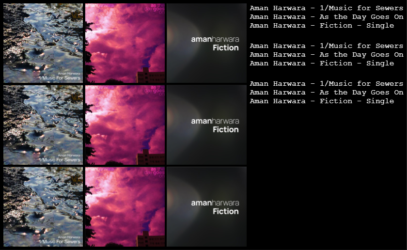
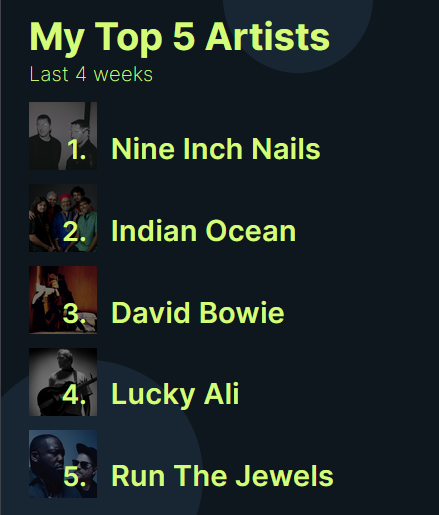
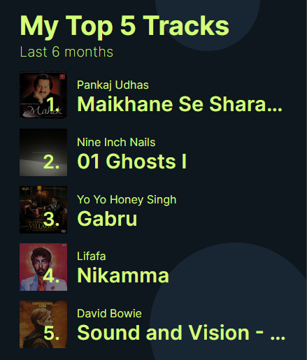

# [Chartr](https://chartr.vercel.app)

Chartr is a free, open-source web app which allows you to create your own, customized music chartrs. 

[](https://vercel.com/new/git/external?repository-url=https%3A%2F%2Fgithub.com%2Famanharwara%2Fchartr) [](https://github.com/amanharwara/chartr/issues) [](https://discord.gg/haBPMvn) [](https://matrix.to/#/!teVYOmxkzmeoismAjI:matrix.org?via=matrix.org)

<a href="https://liberapay.com/~1670630/donate"></a> [](https://ko-fi.com/U7U3114IH) 
### Demo Video:


## Features

### Album Collage

A collage of album covers.

- Show album titles alongside the collage
- Add upto a 100 items
- Customize the font
- Customize the colors
- Change the padding to your wish
- Increase or decrease the gap between the items

#### Example:



### Spotify: Top 5 Artists

Your Top 5 Artists on Spotify (requires login)

- Customize background color
- Customize foreground color
- Change time range



### Spotify: Top 5 Tracks

Your Top 5 Tracks on Spotify (requires login)

- Customize background color
- Customize foreground color
- Change time range



## Roadmap

- Add localization support
- Move to a custom domain instead of a vercel subdomain
- Add more chart options

## Development

Read [CONTRIBUTING.md](CONTRIBUTING.md) before submitting pull requests.

### Initial set-up

```
$ git clone https://github.com/amanharwara/chartr.git
$ cd chartr
$ yarn
or
$ npm install
```

### Build files

`yarn build`

or

`npm run build`

### Start dev server (with live reload)

`yarn dev`

or

`npm run dev`

### Start dev server (without live reload)

`yarn start --host`

or

`npm start --host`
